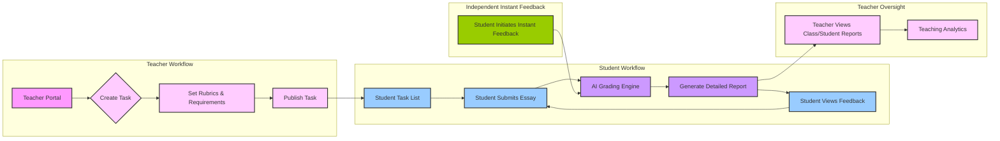

# EssayCoach Platform: Core Features and User Experience Flow

The EssayCoach platform aims to build a smooth, efficient, and intelligent writing learning loop. It's not just a grading tool; it's a smart ecosystem that connects teachers and students, fostering continuous improvement in writing skills.

## 1. Overview of the Platform's Core Workflow

Imagine our system as a smart academic assistant that helps teachers assign tasks, set standards, automatically grades students' essays, provides feedback, and records the entire learning journey.

**The fundamental process can be summarized as:**
**[Teacher] Publishes Task (Sets Standards) → [Student] Submits Essay → [AI] Intelligent Grading → [Student] Instant Feedback & Revision → [Teacher] Views Reports & Teaching Analytics**

In addition to the formal task workflow, students can also use the **"Instant Feedback"** feature to get writing feedback anytime, anywhere, serving as a valuable tool for daily practice and self-improvement.

### Workflow Diagram

Here's a simplified visual representation of how the main processes flow:

---

## 2. Teacher's Role: Task Creation & Standard Setting (The "Command Center" for Teaching)

As a teacher, you will have powerful teaching management capabilities within the EssayCoach platform:

1.  **Log in to the platform and access your Teacher Dashboard:**
    *   You'll see a clean, clear interface providing an overview of your class or students' overall progress and performance.

2.  **Create a new writing task:**
    *   Click "Create New Task" to set all requirements for this assignment, such as:
        *   **Essay Title/Topic:** Clearly define the writing direction for students.
        *   **Detailed Description & Requirements:** E.g., word count, essay style, reference materials.
        *   **Deadline:** Set the submission time limit for the task.
        *   **Submission Policy (Fixed):** By default **each student can submit ONE essay per task**.  Teachers can optionally enable the *"Return for Revision"* action later (see below) which re-opens the submission.  Students cannot create additional parallel submissions for assigned tasks. However, multiple submission for exercises are allowed.

3.  **Upload or customize grading standards (Rubrics):**
    *   This is a core control point for teachers on the EssayCoach platform. You can:
        *   **Import Existing Standards:** If you have commonly used assessment rubrics, you can directly upload them to the platform.
        *   **Customize Standards:** Flexibly create new grading dimensions and corresponding rating descriptions within the platform for this specific task (e.g., "Clarity of Argument," "Evidence Support," "Structure & Logic," "Language & Expression"), and set different score ranges and evaluation criteria for each dimension.
    *   **Core Purpose:** These grading standards, set by you, will directly **guide the AI on how to understand and evaluate student essays**. This ensures that the AI's grading results **highly align with your teaching goals and priorities**, rather than being generic evaluations.

4.  **Select AI Evaluation Features:**
    *   You can enable or disable specific AI assistance features based on task requirements, such as:
        *   Whether to perform **Fact-Checking** (if the assignment content involves factual statements).
        *   Whether to provide **Grammar and Spelling Optimization suggestions**.
        *   Whether to provide **Vocabulary and Style Enhancement suggestions**.

5.  **Publish Task:**
    *   After completing all settings, click "Publish." The task will immediately appear in your students' task lists, and they can start viewing and preparing their submissions.

6.  **Teacher Oversight and Final Grading Authority:**
    *   While the AI provides comprehensive scoring and feedback, **teachers retain the ultimate authority to determine the final grade.**  After reviewing, a teacher can:
        * **Accept & Finalise Grade** – locking the submission. Students may still refine the essay *inline* within the same record (AI-assisted editing) but cannot resubmit a new file.
        * **Return for Revision** – unlocks the submission so the student can upload a *replacement* version (still counted as the single submission for that task).

---

## 3. Student's Role: Submission & Getting Task Feedback (The Efficient "Learning Loop")

Once the teacher publishes a task, students can begin their learning journey:

1.  **Log in to the platform and view tasks:**
    *   Upon logging in, students will see a list of all pending or completed writing tasks on their personal homepage.

2.  **Submit Essay:**
    *   Students select the corresponding task and submit their single allowed essay.  The platform supports various submission methods, such as:
        *   **Directly pasting text.**
        *   **Uploading document files** (e.g., Word, PDF, TXT).
    *   The system will automatically receive and process the submitted essay.

3.  **AI Intelligent Grading :**
    *   Once an essay is submitted, the system will **immediately activate its powerful AI evaluation engine**. It will perform a multi-dimensional, in-depth analysis and evaluation of the essay based on the grading standards set by the teacher for that task.
    *   **Feedback Speed:** Typically within **tens of seconds to up to ten minutes ** (depending on essay length and system load), students will receive a detailed AI grading report.

4.  **Review Grading Report:**
    *   The grading report is highly interactive and visual, allowing students to clearly see:
        *   **Overall Score:** The total score calculated based on the teacher-set Rubric.
        *   **Sub-score Breakdown & Detailed Comments:** For each grading standard (e.g., "Clarity of Argument," "Structure & Logic"), the AI will provide specific scores and textual comments explaining why that score was given, helping students understand reasons for deductions or bonuses.
        *   **Fact-Check Results:** The AI will highlight all factual statements in the essay that were checked, indicating "verified," "disputed," or "no supporting source found," along with links to authoritative sources, guiding students to verify information.
        *   **Writing Improvement Suggestions:**
            *   **Grammar & Spelling:** Precisely point out and suggest corrections for grammatical errors, spelling mistakes, and punctuation issues.
            *   **Vocabulary:** Identify repetitive or inappropriate word usage, providing more precise, richer synonyms or expressions.
            *   **Structure & Style:** Offer optimization suggestions for passive voice, complex syntax sentence, passive voice, and in-text citation format, etc., to improve the essay's flow and readability.
            *   These features are also available separately as per user's request
    
5.  **Revise and Iterate:**
    *   If the teacher **returns** the submission, the student may upload an updated file which **replaces** the original (version history is preserved).  
    *   Once the grade is *finalised*, the file upload channel closes.  Students can still **edit the essay inline on the platform with real-time AI suggestions** (tracked as drafts) or discuss with the teacher, but no new submission object is created.
    *   Mobile clients are **read-only** – they allow students to view feedback, version history, and AI suggestions on the go, but uploading/replacing essays must be done on the web app.

---

## 4. Special Feature: Independent Instant Feedback ("Quick Practice" - Your Personal Writing Coach)

Beyond the teacher-assigned task grading workflow, EssayCoach also offers an independent "Instant Feedback" feature, allowing students to get writing feedback **anytime, anywhere**, serving as a valuable tool for daily practice and self-improvement:

*   **Scenario:** When students are practicing writing, drafting, or simply want to check a piece of text for grammar and logic, they don't need to wait for a teacher to publish a task.
*   **How It Works:** Students simply go to the "Instant Feedback" interface, paste or upload the text they want to check (it can be a phrase, paragraph, or entire essay), 
* and the system will immediately perform an AI evaluation, but a rubric is required to be created (available in the platform, customized by student, or generated by AI).
*   **Feedback Characteristics:** 
    *   The AI will use a default, general set of writing assessment standards for quick analysis.
    *   It primarily provides real-time suggestions regarding grammar, spelling, style, logic, and vocabulary.
    *   Other features including fact check are available as per request, but not generated with report automatically.
    *   **Not Counted Towards Formal Grades:** This feature is purely for 1self-diagnosis and immediate improvement. It is not linked to specific tasks or grades, making it a "personal coach" for students to enhance their writing skills.
*   Every student will get limitted number of attempts in a duration, e.g., 5 times a week

---

## 5. Behind the Scenes: AI Evaluation Process (Ensuring Accuracy)

Our AI system acts like an experienced, tireless grading teacher. It achieves efficient and accurate grading through complex algorithms and advanced natural language processing technologies:

*   **Intelligent Analysis:** The AI first deeply analyzes the content, context, and writing intent of the essay.
*   **Standard Matching:** Against the teacher-set specific task standards or general evaluation standards, the AI meticulously assesses and scores each item.
*   **Vast Knowledge Base:** Combining a massive language knowledge base and real-time retrieval capabilities, the AI can accurately identify grammatical errors, suggest vocabulary, and perform reliable fact-checking.
*   **Report Generation:** Finally, the AI structures these analysis results into a clear, easy-to-read grading report.
*   **Adaptive Learning:** Our AI marking model is designed for continuous improvement. It can **learn from teacher feedback and adjustments**. When teachers modify AI-generated scores or provide specific comments on essays, the system uses this input to refine its future assessments, ensuring it increasingly aligns with your institution's unique grading standards and preferences.

The entire evaluation process is **automated** and **high-performance**, designed to ensure students receive timely, consistent, and insightful feedback that truly helps them improve their writing skills.

---

## 6. Administrator Panel: Centralized Control and Oversight

The Admin Panel is designed for school administrators and system managers, providing a powerful, centralized hub for managing the entire EssayCoach platform within your institution. It ensures smooth operation, proper resource allocation, and compliance with school policies.

**What the Admin Panel Does:**

*   **User Management:**
    *   **Create/Manage Accounts:** Add new teachers and students manually or through bulk import (e.g., CSV files) for efficient onboarding.
    *   **Role Assignment:** Easily assign user roles (Administrator, Teacher, Student) to control access and permissions within the platform.
    *   **Account Deactivation:** Suspend or remove user accounts as needed (e.g., when students graduate or teachers leave).
*   **Class & School Organization:**
    *   **Manage Classes/Groups:** Create, modify, and assign students and teachers to specific classes or cohorts, mirroring your school's organizational structure.
    *   **School-Wide Settings:** Configure settings that apply across your entire institution.
*   **System Configuration (Global):**
    *   **Default Rubrics:** Manage a library of standard or template grading rubrics that teachers can use as a starting point for their tasks, ensuring consistency across departments if desired.
    *   **Feature Toggles:** Control the availability of certain platform features at an institutional level (e.g., whether the "Instant Feedback" feature is enabled for all students).
*   **Data Oversight & Analytics (Anonymized):**
    *   **Usage Reports:** View aggregated data on platform usage, such as the number of essays submitted, active users, and peak usage times. This helps in understanding platform adoption and resource planning.
    *   **Overall Performance Trends:** Access high-level, anonymized reports on writing performance trends across your student body or specific grades. This data can inform curriculum adjustments and pedagogical strategies without exposing individual student details.
    *   **System Health:** Monitor the general health and performance of the platform to ensure uninterrupted service.
*   **Security & Compliance:**
    *   **Access Control:** Define and manage permissions for different user roles to ensure data security and prevent unauthorized access.
    *   **Privacy Management:** Oversee compliance with data privacy regulations (e.g., GDPR, local regulations), ensuring student data is handled appropriately and securely.

The Admin Panel provides you with the necessary tools to effectively manage and optimize the EssayCoach platform for your institution, giving you control and insights into its overall operation and impact.

---

## 7. What Kind of Data Do We Collect and Why? (Your Privacy, Our Priority)

We understand that data privacy is paramount, especially in an educational context. EssayCoach is designed with data security and responsible usage at its core. We only collect data that is essential for providing the service, improving its functionality, and offering valuable educational insights.

**Data We Collect:**

*   **User Account Information:**
    *   **What:** Names, email addresses, assigned roles (Student, Teacher, Admin), and the classes/schools they belong to.
    *   **Why:** To create and manage individual user accounts, enable secure login, assign appropriate permissions, and connect students to their teachers and tasks.
*   **Essay Submission Content:**
    *   **What:** The actual text or document files (e.g., Word, PDF) of the essays submitted by students.
    *   **Why:** This is the core input for our AI evaluation engine. Without the essay content, the AI cannot perform its grading, fact-checking, or provide writing suggestions. This data is processed securely and used solely for the purpose of generating feedback.
*   **AI Evaluation Results:**
    *   **What:** The output generated by the AI for each essay, including scores (overall and per criterion), detailed feedback comments, fact-check outcomes with sources, and all grammar/style/vocabulary suggestions.
    *   **Why:** To provide students with their detailed feedback reports, allow teachers to review student performance, and track student progress over time.
*   **Submission Metadata:**
    *   **What:** Information about each submission, such as the date and time of submission, the associated task ID, and the version history for multiple revisions.
    *   **Why:** To track student progress, manage submission deadlines, and enable students and teachers to review the evolution of an essay through different drafts.
*   **Aggregated Usage Data (Anonymized):**
    *   **What:** Non-identifiable data about how the platform is used, such as the total number of essays submitted per day, the most frequently used features, or general system performance metrics.
    *   **Why:** To understand overall platform usage patterns, identify areas for improvement, optimize system performance, and inform future feature development. **This data is always aggregated and anonymized, meaning it cannot be traced back to individual students or specific essays.**

**Our Commitment to Data Privacy:**

*   **Purpose-Driven Collection:** We only collect data that is necessary for the educational services we provide.
*   **Secure Handling:** All data is stored and processed with robust security measures, including encryption, to protect against unauthorized access.
*   **Strict Access Control:** Access to sensitive data is strictly limited to authorized personnel and system processes, only when required for platform operation or support.
*   **Anonymization for Reporting:** Any reporting or analytics shared with administrators about student performance trends will always be based on aggregated and anonymized data, safeguarding individual student privacy.
*   **Compliance:** We adhere to relevant data protection regulations to ensure your institution and students' data rights are protected.

By understanding what data is collected and why, you can be confident that EssayCoach is a secure and responsible partner in enhancing writing education.