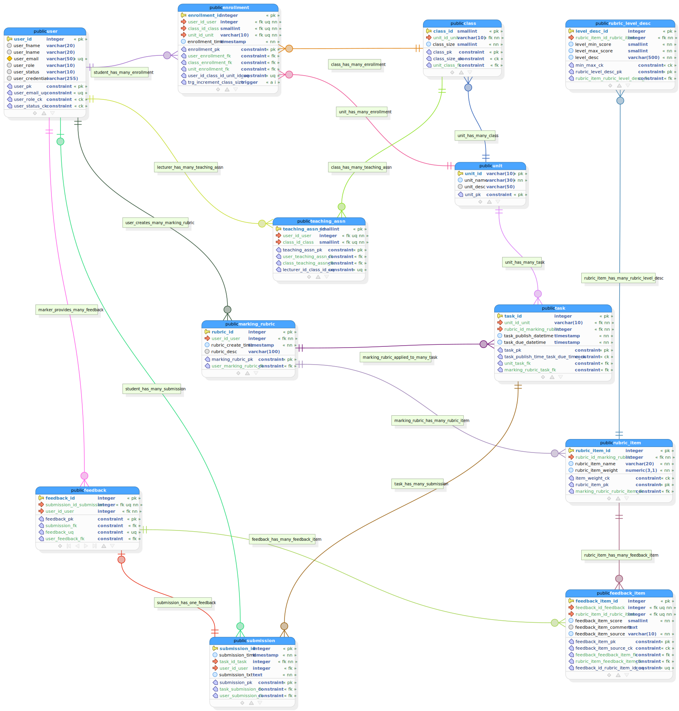

# Database ERD Diagram

## 📊 Visual Schema Representation

The complete entity-relationship diagram for the EssayCoach database system is available below. This SVG diagram provides a comprehensive view of all database tables, their relationships, and constraints.

## 🖼️ Database Schema Diagram

  
  

    Complete database schema showing all tables, relationships, and constraints
  

## 🔍 Schema Details

### Primary Entities
The diagram includes the following main entities:

- **Users**: Authentication and profile management
- **Essays**: Essay submissions with metadata
- **Feedback**: AI-generated feedback and scores
- **Analytics**: Usage metrics and performance data
- **Reports**: Generated reports for educators

### Relationships Shown
- **One-to-Many** relationships between users and essays
- **One-to-Many** relationships between essays and feedback
- **Many-to-One** relationships for categorization
- **One-to-One** relationships for user profiles

### Key Features Visualized
- **Primary keys** for each table
- **Foreign key relationships** with referential integrity
- **Indexes** for performance optimization
- **Constraints** for data validation
- **Data types** for each field

## 📋 How to Use This Diagram

### For Developers
1. **Design Phase**: Use for understanding data relationships
2. **Development**: Reference when writing queries or migrations
3. **Debugging**: Identify potential data integrity issues
4. **Optimization**: Understand index usage and query patterns

### For Database Administrators
1. **Schema Validation**: Verify table structures and relationships
2. **Performance Tuning**: Identify optimization opportunities
3. **Migration Planning**: Plan schema changes safely
4. **Documentation**: Share with team for consistent understanding

## 🔄 Keeping Updated

This diagram represents the current database schema as of the latest migrations. It is automatically updated when:
- New migrations are applied
- Schema changes are made
- Table relationships are modified

For the most current version, always refer to the latest deployment branch.