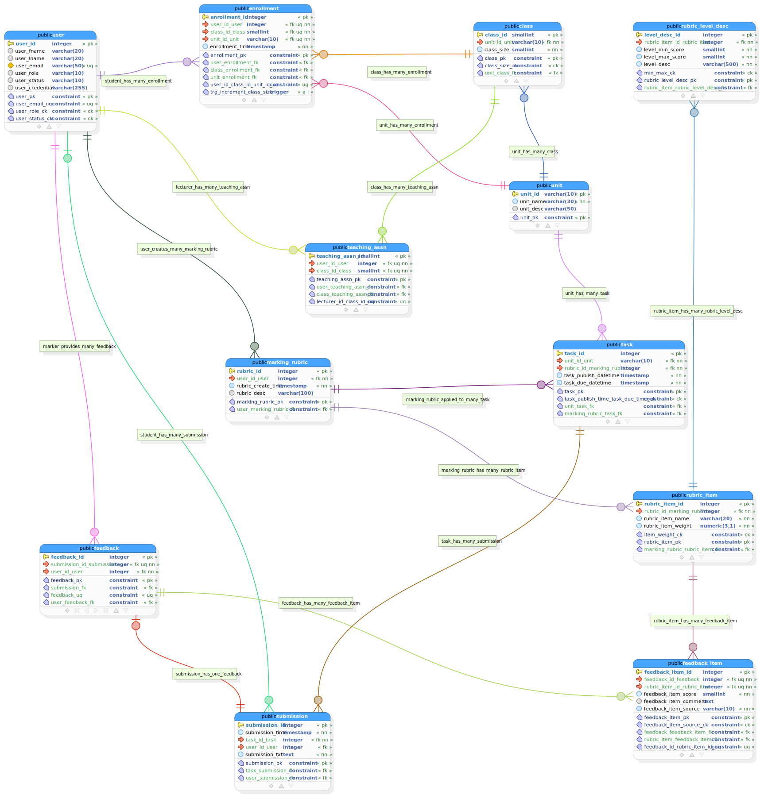

# Database Design

## 📊 Schema Overview

The EssayCoach database is designed as a normalized PostgreSQL schema supporting essay submissions, AI feedback, user management, and educational analytics.

## 🗂️ Database Schema Diagram

The current database schema is visualized below:



## 🏗️ Core Entities

### Users and Authentication
- **Users**: Custom `public."user"` table aligned with Django auth fields (password/last_login/is_active/is_staff/is_superuser/date_joined) and business fields (email, first/last name, status)
- **Groups/Permissions**: Django-native groups and permissions via `core_user_groups` and `core_user_user_permissions`
- **Roles**: Student, Lecturer, Admin represented by groups (legacy `user_role` retained for compatibility)
- **Authentication**: JWT tokens with refresh mechanism

### Essay Management
- **Essays**: Essay submissions with metadata and content
- **Categories**: Essay categorization for analytics
- **Submissions**: Submission history and versioning

### AI Feedback System
- **Feedback**: AI-generated feedback with confidence scores
- **FeedbackTypes**: Different types of feedback (grammar, structure, content)
- **AIResponses**: Raw AI responses for debugging and improvement

### Analytics and Monitoring
- **Analytics**: Usage metrics and performance data
- **Reports**: Educator reports and student progress tracking
- **Logs**: System logs for debugging and monitoring

## 🔄 Relationships and Constraints

### Primary Relationships (selected)
```sql
-- User (custom) to Submissions (One-to-Many)
public."user".user_id → submission.user_id_user

-- User to Groups (Many-to-Many)
public."user".user_id ↔ core_user_groups(user_id, group_id) ↔ auth_group.id

-- User to Permissions (Many-to-Many)
public."user".user_id ↔ core_user_user_permissions(user_id, permission_id) ↔ auth_permission.id
```

### Foreign Key Constraints
- Referential integrity enforced for core entities
- CASCADE deletes on join tables (user/group, user/permission)
- Indexes on foreign keys for performance

## 📈 Performance Optimizations

### Indexes
```sql
-- Join tables
CREATE INDEX core_user_groups_user_idx ON core_user_groups(user_id);
CREATE INDEX core_user_groups_group_idx ON core_user_groups(group_id);
CREATE INDEX core_user_user_permissions_user_idx ON core_user_user_permissions(user_id);
CREATE INDEX core_user_user_permissions_perm_idx ON core_user_user_permissions(permission_id);
```

### Partitioning Strategy
- Large tables partitioned by date for performance
- Indexes optimized for common query patterns
- Materialized views for complex analytics

## 🔄 Migration Strategy

### Schema Evolution
1. **Django Migrations**: Automated schema updates
2. **Backward Compatibility**: Maintain compatibility during upgrades
3. **Data Migration**: Handle data transformations safely
4. **Rollback Capability**: Ability to revert migrations if needed

### Version Control
- All migrations tracked in version control
- Review process for schema changes
- Testing with production-like data
- Rollback procedures documented

## 🛡️ Data Security

### Encryption
- Sensitive data encrypted at rest
- Password hashing with Django's default algorithm
- API tokens stored securely

### Access Control
- Row-level security for multi-tenant setups
- Database-level permissions for different roles
- Audit trails for data changes

## 🧪 Testing Strategy

### Database Testing
- **Unit Tests**: Model validation and business logic
- **Integration Tests**: Database migrations and queries
- **Performance Tests**: Load testing with realistic data volumes
- **Backup Tests**: Regular backup and restore procedures

### Data Quality
- Validation rules enforced at database level
- Data integrity checks via Django validators
- Regular data quality audits
- Automated cleanup for orphaned records

## 📊 Monitoring and Maintenance

### Health Checks
- Database connection monitoring
- Query performance tracking
- Disk space monitoring
- Replication lag monitoring

### Optimization
- Query optimization based on usage patterns
- Index usage analysis
- Regular VACUUM and ANALYZE operations
- Connection pooling configuration

## 🔍 Query Examples

### Common Queries
```sql
-- Get all essays for a user with feedback count
SELECT e.*, COUNT(f.id) as feedback_count
FROM essays e
LEFT JOIN feedback f ON e.id = f.essay_id
WHERE e.user_id = ?
GROUP BY e.id;

-- Get analytics for a date range
SELECT DATE(created_at) as date, COUNT(*) as submissions
FROM essays
WHERE created_at BETWEEN ? AND ?
GROUP BY DATE(created_at);
```

### Performance Queries
```sql
-- Slow query analysis
EXPLAIN ANALYZE SELECT * FROM essays WHERE user_id = ? AND status = 'completed';

-- Index usage analysis
SELECT schemaname, tablename, attname, n_distinct
FROM pg_stats
WHERE tablename = 'essays';
```
